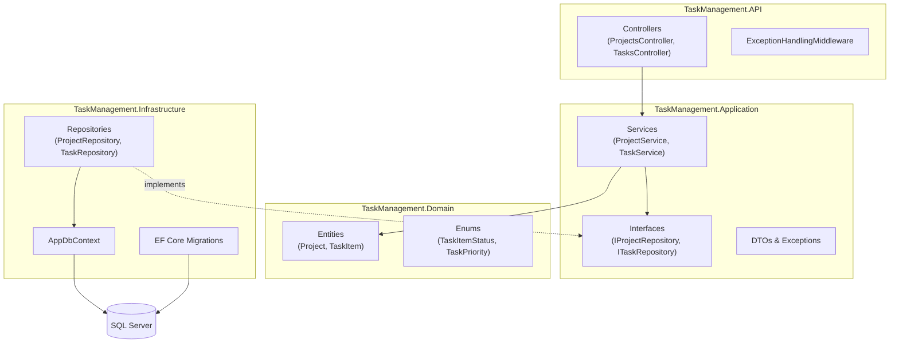
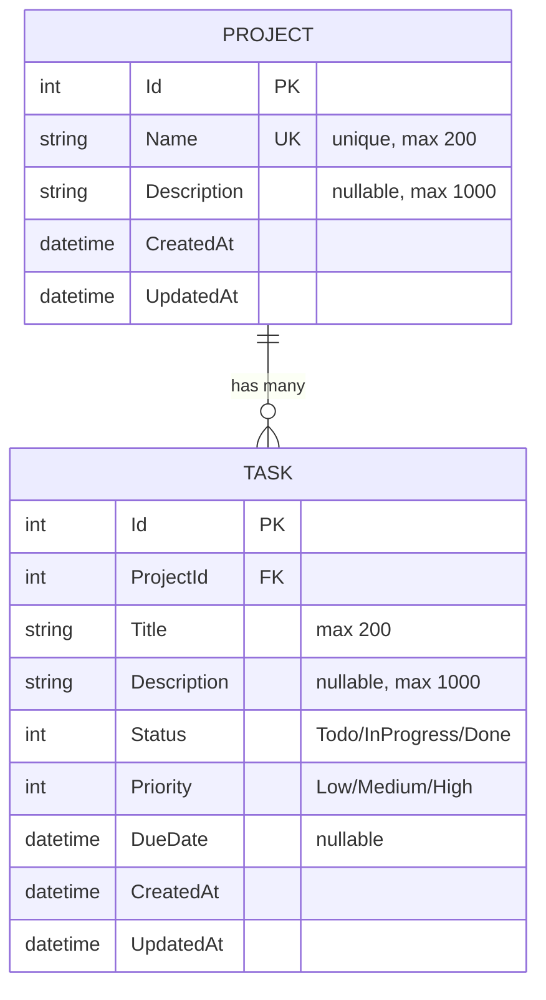

# Task Management API

A REST API for managing projects and tasks with filtering, sorting, search, pagination, and validation.

---

## Table of Contents

- [Architecture](#architecture)
- [Setup Instructions](#setup-instructions)
- [API Documentation](#api-documentation)
- [Business Rules & Validation](#business-rules--validation)
- [Schema Design & Rationale](#schema-design--rationale)
- [Testing](#testing)
- [Design Decisions](#design-decisions)

---

## Architecture

The solution follows a layered Clean Architecture approach, split into four projects: `Domain`, `Application`, `Infrastructure`, and `API`. The goal is separation of concerns between these layers, with dependencies pointing toward the core (`Domain`), so business logic doesn't depend on EF Core, ASP.NET Core, or any other framework detail. This isn't a strict, textbook implementation of every Clean Architecture convention — it's a pragmatic layering aimed at keeping the business logic testable and framework-independent.



**Dependency direction:** `API → Application → Domain`, with `Infrastructure` implementing the repository interfaces defined in `Application`. This means `Application` has no reference to EF Core or SQL Server at all — swapping the database technology only touches `Infrastructure`.

| Layer | Responsibility |
|---|---|
| **Domain** | Entities and enums only. No dependencies on any other project. |
| **Application** | Business logic, validation, DTOs, custom exceptions, and repository/service interfaces. Depends only on Domain. |
| **Infrastructure** | EF Core `DbContext`, entity configurations, migrations, and repository implementations. |
| **API** | Controllers, global exception handling middleware, and DI wiring. |

---

## Setup Instructions

### Prerequisites

- [.NET 8 SDK](https://dotnet.microsoft.com/download/dotnet/8.0)
- SQL Server (LocalDB, a full instance, or a Docker container)
- (Optional) [EF Core CLI tools](https://learn.microsoft.com/ef/core/cli/dotnet): `dotnet tool install --global dotnet-ef`

### 1. Clone the repository

```bash
git clone https://github.com/Sherif-Osama/Task-Management-API.git
cd Task-Management-API
```

### 2. Restore dependencies

```bash
dotnet restore
```

### 3. Configure the database connection

Open `TaskManagement.API/appsettings.json` and adjust the connection string if needed. The default uses Windows Authentication against a local SQL Server instance:

```json
{
  "ConnectionStrings": {
    "DefaultConnection": "Server=.;Database=TaskManagementDB;Trusted_Connection=True;TrustServerCertificate=True;"
  }
}
```

If you're on macOS/Linux or using SQL Server in Docker, replace it with a SQL authentication string instead, for example:

```json
"Server=localhost,1433;Database=TaskManagementDB;User Id=sa;Password=YourPassword123!;TrustServerCertificate=True;"
```

### 4. Apply database migrations

```bash
dotnet ef database update --project TaskManagement.Infrastructure --startup-project TaskManagement.API
```

This creates the database and applies both migrations (`InitialCreate` and `AddTaskIndexes`), including tables, the `Project.Name` unique constraint, the cascade-delete foreign key, and all indexes.

### 5. Run the API

```bash
dotnet run --project TaskManagement.API
```

The API will start (by default) on `https://localhost:7xxx`. Open:

```
https://localhost:7xxx/swagger
```

to explore and try every endpoint interactively via Swagger UI.

---

## API Documentation

All responses are JSON. All list endpoints return a paginated envelope:

```json
{
  "items": [ /* ... */ ],
  "totalCount": 42
}
```

### Error Response Format

Every error (400 / 404 / 409 / 500) returned by the global exception middleware has the same shape:

```json
{
  "statusCode": 404,
  "message": "Project with ID 99 does not exist."
}
```

| Exception | Status Code | When |
|---|---|---|
| `ValidationException` | 400 Bad Request | Invalid input (missing/too-long fields, invalid enum, bad pagination, past due date, etc.) |
| `NotFoundException` | 404 Not Found | Project or Task ID doesn't exist, or an invalid foreign key was supplied |
| `ConflictException` | 409 Conflict | Duplicate project name |
| Any other exception | 500 Internal Server Error | Unexpected error (message is generic, no internal details leaked) |

---

### Projects

#### Create a project

```
POST /api/projects
```

Request body:
```json
{
  "name": "Website Redesign",
  "description": "Q3 marketing site overhaul"
}
```

Response `201 Created`:
```json
{
  "id": 1,
  "name": "Website Redesign",
  "description": "Q3 marketing site overhaul",
  "createdAt": "2026-07-24T10:00:00",
  "updatedAt": "2026-07-24T10:00:00"
}
```

#### List projects (paginated)

```
GET /api/projects?page=1&limit=10
```

Response `200 OK`:
```json
{
  "items": [
    {
      "id": 1,
      "name": "Website Redesign",
      "description": "Q3 marketing site overhaul",
      "createdAt": "2026-07-24T10:00:00",
      "updatedAt": "2026-07-24T10:00:00"
    }
  ],
  "totalCount": 1
}
```

#### Get a single project

```
GET /api/projects/{id}
```

#### Update a project

```
PUT /api/projects/{id}
```

Request body:
```json
{
  "name": "Website Redesign v2",
  "description": "Updated scope"
}
```

#### Delete a project

```
DELETE /api/projects/{id}
```

Response `204 No Content`. Cascades and deletes every task belonging to the project.

---

### Tasks

#### Create a task under a project

```
POST /api/projects/{projectId}/tasks
```

Request body:
```json
{
  "title": "Design homepage mockup",
  "description": "Include mobile breakpoints",
  "priority": "High",
  "dueDate": "2026-08-01T00:00:00"
}
```

`priority` defaults to `"Medium"` and `dueDate` is optional. New tasks always start with `status: "Todo"`.

Response `201 Created`:
```json
{
  "id": 10,
  "projectId": 1,
  "title": "Design homepage mockup",
  "description": "Include mobile breakpoints",
  "status": "Todo",
  "priority": "High",
  "dueDate": "2026-08-01T00:00:00",
  "createdAt": "2026-07-24T10:05:00",
  "updatedAt": "2026-07-24T10:05:00"
}
```

#### List tasks for a project (paginated, filterable, sortable)

```
GET /api/projects/{projectId}/tasks?status=Todo&priority=High&dueDateFrom=2026-08-01&dueDateTo=2026-08-31&sortBy=DueDate&sortDirection=Desc&page=1&limit=10
```

All query parameters are optional.

#### List all tasks across all projects (paginated, filterable, sortable, searchable)

```
GET /api/tasks?q=homepage&status=Todo&priority=High&sortBy=CreatedAt&sortDirection=Asc&page=1&limit=10
```

Response `200 OK` — note `projectName` is always included here so the caller doesn't need a second request:
```json
{
  "items": [
    {
      "id": 10,
      "projectId": 1,
      "projectName": "Website Redesign",
      "title": "Design homepage mockup",
      "status": "Todo",
      "priority": "High",
      "dueDate": "2026-08-01T00:00:00"
    }
  ],
  "totalCount": 1
}
```

**Query parameters:**

| Parameter | Type | Description |
|---|---|---|
| `status` | `Todo` \| `InProgress` \| `Done` | Filter by status |
| `priority` | `Low` \| `Medium` \| `High` | Filter by priority |
| `dueDateFrom` / `dueDateTo` | date | Filter by due date range (inclusive) |
| `sortBy` | `DueDate` \| `Priority` \| `CreatedAt` | Sort field (defaults to `CreatedAt desc` if omitted) |
| `sortDirection` | `Asc` \| `Desc` | Sort direction (default `Asc`) |
| `q` | string | Partial, case-insensitive search across `title` and `description` — **only available on `GET /api/tasks`**, not the project-scoped listing (see [Design Decisions](#design-decisions)) |
| `page` | int | Page number, 1-based (default `1`) |
| `limit` | int | Page size, 1–100 (default `10`) |

#### Get a single task

```
GET /api/tasks/{id}
```

#### Update a task

```
PUT /api/tasks/{id}
```

Request body (full replace — all fields required except `description`/`dueDate`):
```json
{
  "title": "Design homepage mockup",
  "description": "Include mobile breakpoints",
  "status": "Done",
  "priority": "High",
  "dueDate": "2026-08-01T00:00:00"
}
```

#### Delete a task

```
DELETE /api/tasks/{id}
```

Response `204 No Content`.

---

## Business Rules & Validation

| Rule | Enforced by |
|---|---|
| A task must belong to exactly one project | `ProjectId` foreign key (`NOT NULL`), verified against the DB before creation |
| Deleting a project cascades to its tasks | `OnDelete(DeleteBehavior.Cascade)` at the DB level |
| A task's due date cannot be in the past | Validated on create; on update, only re-validated if the due date actually changed (so a task with an already-past due date can still be closed) |
| `done → todo` transitions are unusual but allowed | Transition is accepted; a warning is logged via `ILogger`, no exception is thrown |
| Duplicate project names are rejected | `ConflictException` (409) at the application layer **and** a unique index on `Project.Name` at the DB layer |
| Invalid foreign keys return 404, not 500 | `NotFoundException` is thrown before any write occurs whenever a referenced `ProjectId`/task `Id` doesn't exist |
| Pagination limits are bounded | `page > 0`, `limit` between 1 and 100 |

---

## Schema Design & Rationale



### Indexes

| Index | Rationale |
|---|---|
| `Project.Name` (unique) | Enforces "duplicate project names are rejected" directly at the database level, as a second line of defense behind the application check |
| `Task.Status` | Task listing is filtered by status on nearly every request |
| `Task.Priority` | Same — filtering and sorting both use it |
| `Task.DueDate` | Used for both range filtering (`dueDateFrom`/`dueDateTo`) and sorting |
| `Task.(ProjectId, Status)` composite | Covers the most common real-world query: "tasks for project X with status Y" (`GET /api/projects/{id}/tasks?status=...`) without needing to merge two separate index scans |

### Why a Repository pattern instead of direct `DbContext` access in services

Services depend on `IProjectRepository` / `ITaskRepository` interfaces (defined in `Application`), not on EF Core directly. This keeps business logic testable with plain mocks (no `DbContext` needed in unit tests) and keeps `Application` fully persistence-agnostic.

### Why DTOs are separate from Entities

Entities carry EF Core navigation properties (`Project.Tasks`, `TaskItem.Project`) that would otherwise cause circular references or over-fetching if serialized directly. DTOs are shaped per-endpoint — for example, `TaskListResponse` includes a flattened `projectName` string instead of the full `Project` object.

---

## Testing

The solution includes both unit and integration tests in `TaskManagement.Tests`.

### Unit Tests (`ProjectServiceTests.cs`, `TaskServiceTests.cs`)

Business logic is tested in isolation using Moq to mock `IProjectRepository` / `ITaskRepository`, with no database involved. Coverage includes:
- Input validation (empty/oversized titles, names, descriptions)
- Due date checks (past dates rejected on create; unchanged past due dates allowed to pass through on update)
- Status transition handling (`Done → Todo` is allowed, not rejected)
- Duplicate project name detection
- Not-found / invalid-ID handling

### Integration Tests (`CriticalFlowsIntegrationTests.cs`)

Run against a real in-memory ASP.NET Core host (`WebApplicationFactory`) backed by EF Core's InMemory provider, exercising the full HTTP pipeline — routing, controllers, services, and the exception middleware together. Each test gets its own isolated database instance.

Covers the 3 required critical flows:
1. **`CreateProject_AddTask_MarkDone_DeleteProject`** — full lifecycle, including verifying the task is actually gone (cascade delete) after the project is deleted.
2. **`FilterTasks_ByStatusAndPriority_ReturnsOnlyMatchingTasks`** — verifies the filtered result set, not just a 200 status code.
3. **`SearchTasks_WithPagination_ReturnsMatchingResultsAndRespectsPageSize`** — verifies `totalCount`, page size, and that no items are duplicated or dropped across pages.

### Running the tests

```bash
dotnet test
```

Or, from within `TaskManagement.Tests`:

```bash
dotnet test TaskManagement.Tests.csproj
```

---

## Design Decisions

A few choices worth calling out explicitly, since they weren't fully spelled out in the original spec:

- **Search (`?q=`) only applies to `GET /api/tasks`, not `GET /api/projects/{id}/tasks`.** Within a single project the task list is already a small, scoped set that filtering and sorting handle well; full-text search adds the most value when you're looking across every project at once and don't already know where a task lives. This matches how the endpoint table in the spec labels the two listings.
- **Project name uniqueness is case-insensitive.** `"Website Redesign"` and `"website redesign"` are treated as the same name, both at the application layer (`StringComparison.OrdinalIgnoreCase`) and implicitly at the database layer (SQL Server's default collation is case-insensitive).
- **`PUT` on tasks/projects is a full replace, not a partial patch.** All fields (except optional ones) must be supplied on every update call.
